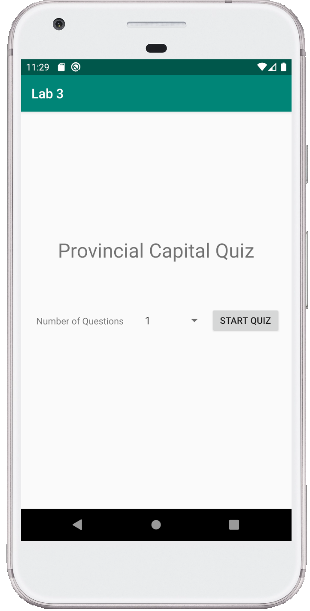
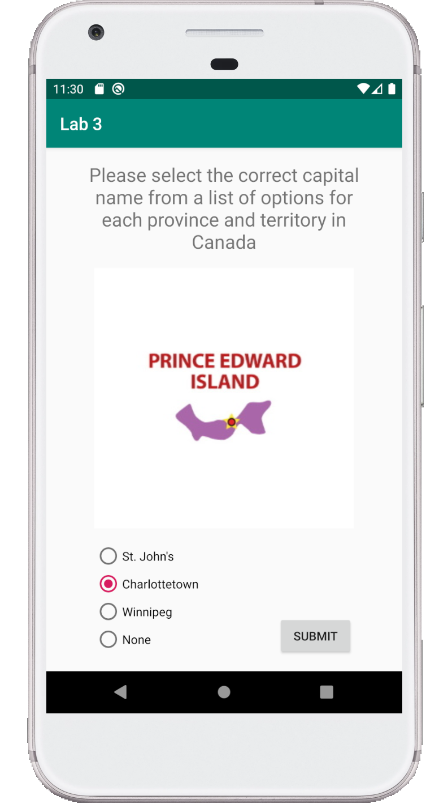
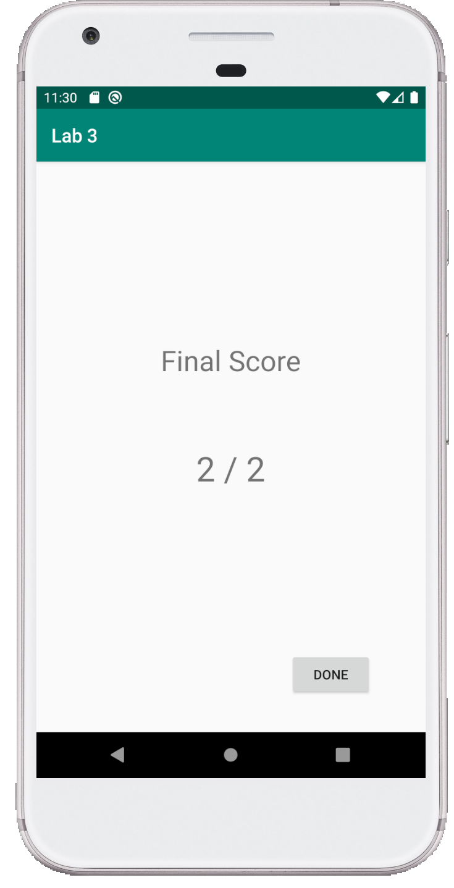

# Android-Quiz-App
A school project to build an Android quiz app with 4 questions. The key design goal of this app was to create a template activity which could load in questions and display them, rather than hardcoding in 4 question activities.

